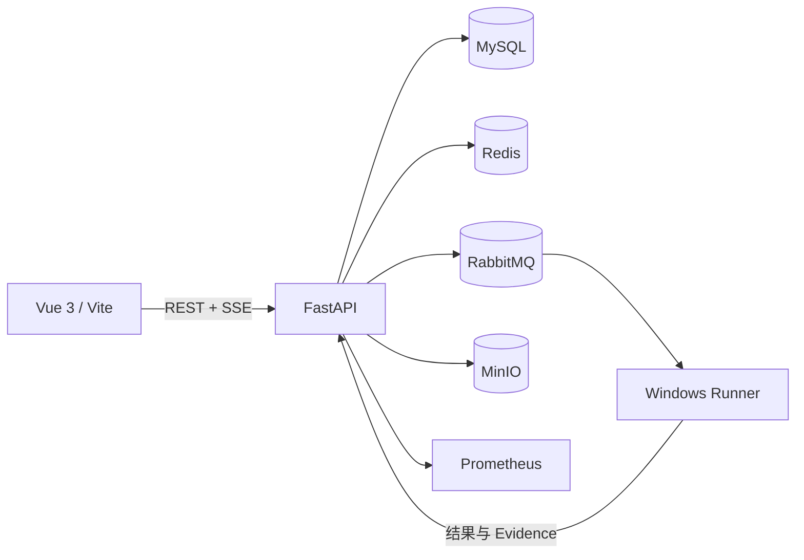

# AI 原生智能测试编排平台

> [!IMPORTANT]
> 🚀 **在线演示已上线**
>
> **[立即访问 AI 原生智能测试编排平台](http://124.220.195.195:8080/)**

面向测试团队的全流程智能测试平台，将需求、API、测试资产、执行编排、Web 自动化、性能测试、证据与报告统一到一个可审计的工作流中。AI 用于辅助评审、生成、修复建议和失败分析，关键资产仍通过结构化契约、版本审批和人工确认进入执行链路。

> 当前状态：V1 主流程已实现，本地自动化发布门禁已通过；真实浏览器矩阵、真实模型、公网 Webhook/CI 以及 Linux/服务器环境仍属于发布前现场验收项。详情见[验收矩阵](文档/V1需求验收矩阵.md)和[集中验收待办](文档/集中验收待办.md)。

## 主要能力

- 需求导入、版本管理、AI 需求评审与需求—资产追溯
- OpenAPI/Swagger 导入、API 用例设计、数据驱动与断言
- API、SQL、脚本和控制流组合的 Scenario 编排
- Web Page/Element/Case 资产、录制、Session、Locator 自愈与失败分析
- API、Web、Scenario 和性能任务的统一调度、取消、强制停止与重试
- Windows Runner 注册、能力/Slot 管理和 RabbitMQ 消费
- Evidence 鉴权存储、报告导出、缺陷草稿和执行审计
- 模型渠道、模型绑定、Prompt 版本及结构化 AI 输出治理
- Scheduler、CI/CD API、Webhook 与 Prometheus 指标

## 架构



| 模块 | 技术 | 职责 |
|---|---|---|
| `frontend` | Vue 3、TypeScript、Vite、Element Plus | 管理控制台与执行工作台 |
| `backend` | Python 3.12、FastAPI、SQLAlchemy、Alembic | API、权限、资产、调度与审计 |
| `runner` | Python 3.12、Playwright、RabbitMQ | API/Web/Scenario/性能任务执行 |
| `deploy` | Docker Compose、Nginx、Prometheus | 本地中间件与服务器部署 |
| `demo` | Python HTTP 服务 | 内置可重复演示目标 |
| `contracts` | JSON Schema | Backend 与 Runner 的消息契约 |

## 环境要求

- Python `3.12.x`
- Node.js `20+`（已使用 Node.js 22 验证）与 npm
- MySQL `8.4`
- Docker Engine/Desktop 与 Docker Compose 插件（用于 Redis、RabbitMQ、MinIO、Prometheus；也可选用容器 MySQL）
- Windows Runner 如需执行 Web 用例，还需要 Chromium/Chrome

默认开发端口：前端 `5173`、后端 `8000`、MySQL `3306`、Redis `6379`、RabbitMQ `5672/15672`、MinIO `9000/9001`、Prometheus `9090`。

## 快速开始（Windows PowerShell）

### 1. 安装依赖

```powershell
py -3.12 -m venv .venv
.venv\Scripts\python.exe -m pip install --upgrade pip
.venv\Scripts\python.exe -m pip install -e ".\backend[dev]"
.venv\Scripts\python.exe -m pip install -e ".\runner"
.venv\Scripts\python.exe -m playwright install chromium

Set-Location frontend
npm ci
Set-Location ..
```

### 2. 准备本地配置

```powershell
Copy-Item backend\.env.example backend\.env
Copy-Item deploy\.env.example deploy\.env
```

示例账号和密码只适用于绑定到 `127.0.0.1` 的本地开发环境。开始共享环境或服务器部署前，必须替换 JWT 密钥、管理员密码、数据库和中间件凭据；不要提交 `.env`、密钥、Runner 身份或验收数据。

### 3. 启动基础设施

已有本机 MySQL 时，只启动其余中间件：

```powershell
docker compose -f .\deploy\docker-compose.dev.yml up -d
```

希望同时使用容器 MySQL 时，确保宿主机 `3306` 未被占用，再运行：

```powershell
docker compose -f .\deploy\docker-compose.dev.yml --profile mysql up -d
```

### 4. 执行数据库迁移

```powershell
Set-Location backend
..\.venv\Scripts\python.exe -m alembic upgrade head
Set-Location ..
```

### 5. 启动后端和前端

在两个终端分别运行：

```powershell
Set-Location backend
..\.venv\Scripts\python.exe -m fastapi dev app\main.py --host 127.0.0.1 --port 8000
```

```powershell
Set-Location frontend
npm run dev
```

打开 `http://127.0.0.1:5173`。后端健康检查位于 `http://127.0.0.1:8000/health`，Swagger UI 位于 `http://127.0.0.1:8000/docs`。

仓库提供了可共享的 `.run` 配置，可直接在 PyCharm 中启动前端、后端、测试和 Runner。首次执行任务前，请先完成下面的 Runner 注册。

## Runner 注册与启动

Runner 当前运行在 Windows 用户环境中。开始前请确认已经安装 Runner 依赖和 Playwright Chromium，并且目标环境的 Backend、Redis 与 RabbitMQ 可用。

### 1. 创建一次性 Registration Token

使用管理员账号登录平台，进入 **Runner 中心**，创建 Registration Token。Token 只展示一次，请立即复制并妥善保管，不要写入命令、脚本、截图或仓库文件。

### 2. 检查本机环境

```powershell
Set-Location runner
..\.venv\Scripts\python.exe -m runner.main inspect
..\.venv\Scripts\python.exe -m runner.main doctor
```

`inspect` 查看当前配置，`doctor` 检查 Windows DPAPI 和状态目录；两条命令都不会打印真实 credential。

### 3. 注册 Runner

连接本地开发环境：

```powershell
..\.venv\Scripts\python.exe -m runner.main register --backend-url http://127.0.0.1:8000 --name windows-runner --tag windows --api-slots 1 --web-slots 1 --performance-slots 1
```

连接已上线环境时，将 Backend 地址替换为公开地址：

```powershell
..\.venv\Scripts\python.exe -m runner.main register --backend-url http://124.220.195.195:8080 --name windows-runner --tag windows --api-slots 1 --web-slots 1 --performance-slots 1
```

命令会交互式提示输入 Registration Token，并隐藏输入内容。注册成功后，credential 只以当前 Windows 用户的 DPAPI 保护形式保存在 `%LOCALAPPDATA%\AI Native Test Platform\runner`，不要复制、编辑或提交该目录。

### 4. 验证身份与心跳

```powershell
..\.venv\Scripts\python.exe -m runner.main heartbeat-once
```

返回 `ACTIVE` 后再启动 Worker。如果返回未授权，请让管理员撤销旧身份并重新生成一次性 Token 注册。

### 5. 配置 RabbitMQ 并启动 Worker

```powershell
$env:AI_TEST_RABBITMQ_URL = "amqp://<用户名>:<密码>@<RabbitMQ主机>:5672/"
..\.venv\Scripts\python.exe -m runner.main worker --web-slots 1 --performance-slots 1
```

RabbitMQ 地址和凭据由目标环境管理员提供，禁止使用 README 中的占位符直接连接。Worker 是前台长期进程：普通 API/Scenario 任务使用 API Slot，Web/录制任务使用 Web Slot，性能任务使用独占 PERFORMANCE Slot。按 `Ctrl+C` 可安全停止领取新任务。

完整的 PyCharm 配置、首次注册说明与故障排查参见[PyCharm 启动指南](文档/01-使用指南/PyCharm启动指南.md#73-启动-runner-worker)。

## 基本检查

```powershell
# Backend
Set-Location backend
..\.venv\Scripts\python.exe -m pytest
..\.venv\Scripts\python.exe -m ruff check app tests

# Runner
Set-Location ..\runner
..\.venv\Scripts\python.exe -m pytest
..\.venv\Scripts\python.exe -m ruff check runner tests

# Frontend
Set-Location ..\frontend
npm run type-check
npm run build
```

部分真实环境测试会在缺少 Chrome、MySQL 或外部中间件时条件跳过；完整门禁和已知边界以验收文档为准。

## 文档导航

- [文档中心](文档/README.md)
- [V1 完整使用说明](文档/01-使用指南/V1项目完整使用说明.md)
- [PyCharm 启动指南](文档/01-使用指南/PyCharm启动指南.md)
- [内置 Demo 操作手册](文档/01-使用指南/内置Demo从零到完整闭环操作手册.md)
- [本地构建镜像与 Ubuntu 部署手册](文档/01-使用指南/本地构建镜像与Ubuntu服务器部署手册.md)
- [当前开发状态](文档/当前开发状态.md)

## 安全与贡献

提交代码前请阅读[贡献指南](CONTRIBUTING.md)和[安全策略](SECURITY.md)。生产配置必须使用专用 Secret、受保护的 Fernet 密钥文件和明确版本的基础设施镜像，不能沿用示例凭据。

## 许可证

仓库当前未包含开源许可证。公开发布前，请由仓库所有者根据预期授权范围选择并加入合适的 `LICENSE` 文件。
